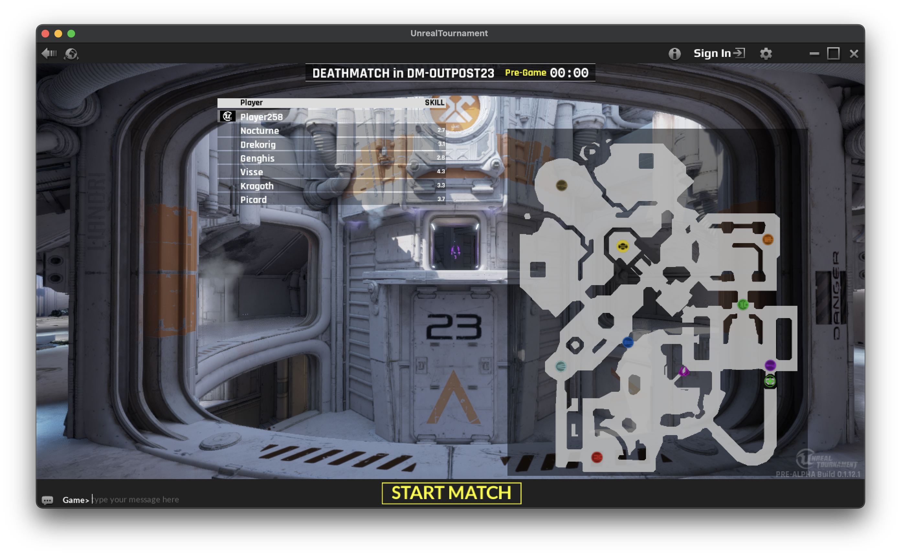

# Tournament — Unreal

A native Unreal Tournament 4 development project with a Tournament-style in-game menu, server-owned deathmatch, automatic arena rotation, and a server event bridge.

**This repository contains our integration code, not Epic's engine or game assets.** It is a development handoff, not a browser game or a downloadable finished UT installer. Demo play awards no money or platform points.



## For Dad

The real UT4 client has run on the Mac with six bots. Both Deck and Outpost 23 load; bot combat, deaths, respawning, scoring, and a completed match have been observed. [See the finished match](evidence/completed-match.png).

The new Tournament layer is being built against the recovered UE4.15 source on Windows. It adds the gold/brown Tournament game styling, top-three standings, and a native menu. The original game retains movement, weapons, player models, and combat feedback.

**Multiplayer runtime verification is pending.** The server stopped at Epic's first-run license requirement. The launchers below require explicit acceptance before starting; a successful build is not evidence that two clients have played together. The newer menu and automatic rotation also need runtime verification in the source-built game.

| Feature | Current evidence |
| --- | --- |
| Preserved UT4 client | Played locally on Mac through CrossOver |
| Six bots, combat, scoring, respawning | Observed in the preserved client |
| Deck and Outpost 23 | Both loaded; match completion observed on Deck |
| Recovered UE4.15 game module | Compiled and linked on Windows |
| Server event bridge and automatic rotation | Compiled and linked; runtime pending |
| Tournament native menu, settings, HUD, reconnect, diagnostics | Compiled and linked on Windows; runtime pending |
| Two-client multiplayer and reconnect | Not yet verified |
| Browser access, Tournament accounts, rewards, anti-cheat | Not connected |

## Windows development setup

Use the recovered **UE4.15 CL3228288** source/content/editor installation. Keep the project separate from the preserved CL3525360 shipping client: they are different versions. See [recovery details and archive sources](docs/recovery.md).

Prerequisites: MSVC v140, Windows SDK 8.1, UCRT 10.0.10240.0, and the restored source/content/editor. The full archive is about 42 GB compressed and 78 GB extracted; reserve additional build space. The scripts accept `-SourceRoot` so the project can live on a different drive.

From this repository in PowerShell:

```powershell
$SourceRoot = 'F:\TournamentUT4\source\UnrealTournament-clean-master'
./scripts/pin-ucrt.ps1 -SourceRoot $SourceRoot
./scripts/build-windows.ps1 -SourceRoot $SourceRoot
./scripts/install-plugin.ps1 -SourceRoot $SourceRoot
./scripts/build-plugin.ps1 -SourceRoot $SourceRoot
```

The UCRT patch is local to the recovered UnrealBuildTool. It avoids selecting a modern CRT that the older compiler cannot compile. These commands build editor modules; they do not package a shipping game.

## Start a local multiplayer development session

First read the Epic/UT agreement included with your own installation. **Only if you accept it**, add `-AcceptLicense` to the first launch. The launcher records that local decision outside this repository. It does not give permission to publish Epic assets or operate a separate commercial UT game.

```powershell
# Server: loopback only by default, 30-frag / 15-minute deathmatch.
./scripts/start-server.ps1 -SourceRoot $SourceRoot -AcceptLicense

# Two separate native client processes, joining the same authoritative server.
./scripts/join-game.ps1 -SourceRoot $SourceRoot -Name Alpha
./scripts/join-game.ps1 -SourceRoot $SourceRoot -Name Bravo
```

Use `-ValidateOnly` to check the required installation/version without starting a game or accepting a license. `-Headless` on a client supports network/log testing, but cannot verify rendering, controls, or menus. The server fills seven total player slots with bots, leaving six bots when one human joins; additional humans replace bots.

For another computer on your trusted LAN, run the server with `-ListenAddress 0.0.0.0`, permit its UDP port **7787** through the host's private-network firewall, and use `-Server HOST_LAN_IP:7787` on a matching source-built client. The launcher intentionally uses UT's LAN mode without pretending that local player names are authenticated Tournament accounts. Public internet hosting and a dad-friendly packaged client remain additional work.

Do not disable version checks or mix the stock shipping client with the source-built development server.

## Controls and Tournament UI

WASD moves, mouse aims, left-click fires, Space jumps, and Tab shows the native scoreboard. The new game mode assigns a Tournament HUD and player controller. Escape opens the Tournament menu; Resume returns mouse control to the game. Local settings cover sensitivity, volume, and fullscreen. Diagnostics shows match state, connection, and estimated ping; Reconnect preserves the active remote server URL. Match rules remain server-owned. PPK payouts and cash rewards are not enabled. These new controls have compiled but still need in-game input/focus tests.

The two-map rotation is configured in [config/Game.ini](config/Game.ini). The custom game mode requests the next arena directly instead of presenting the stock map chooser. It must be loaded on the server **and available in each matching client build**. Merely changing the stock client's INI does not install this functionality.

## Diagnostics and verification

Logs are under `UnrealTournament/Saved/Logs/Tournament` in the restored installation. The launchers return process IDs and log paths. Authoritative match records are under `UnrealTournament/Saved/Tournament/events-*.jsonl`.

```powershell
python scripts/verify-events.py PATH_TO_COMPLETED_MATCH.jsonl
python -m unittest discover -s tests -v
./tests/launchers.ps1
```

The event checker rejects duplicated/out-of-order IDs, events after the final ranking, mixed matches, ineligible kill points, incorrect tied ranks, and any stream marked as real-money play. These checks diagnose recorded server events; they do not authenticate an external upload or settle rewards.

GitHub CI checks the event contract and Windows launcher behavior. CI does **not** compile the proprietary engine or claim multiplayer passed. [Runtime verification checklist](docs/multiplayer-verification.md) · [Tournament integration boundary](docs/integration.md).

## License and credits

Original integration source is MIT-licensed, subject to the exclusions in [LICENSE](LICENSE). Unreal Tournament/Unreal Engine and their content are Epic Games property and separately licensed. Screenshots depict Epic's game and are not MIT-licensed assets. See [NOTICE](NOTICE). No Epic source, game packages, credentials, or binaries are included in this repository.
