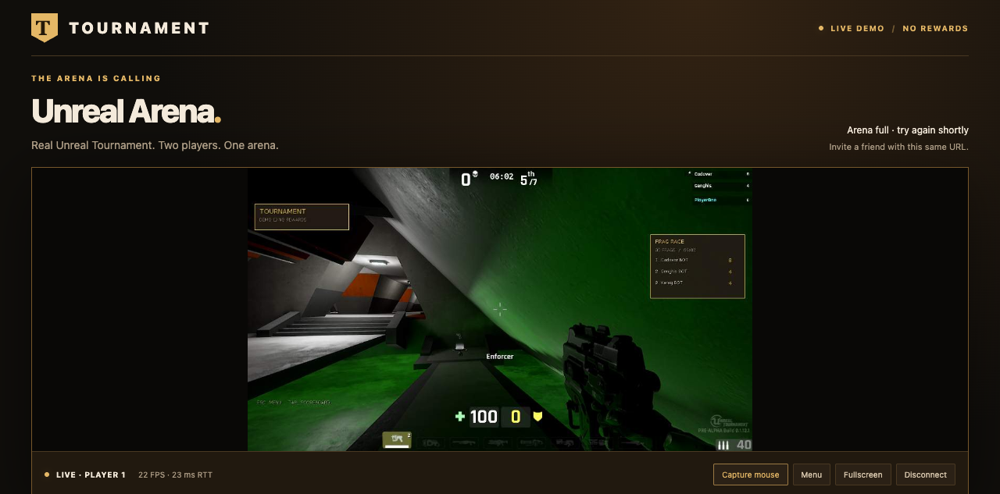

# Tournament — Unreal

Real Unreal Tournament 4, streamed into a desktop browser with a Tournament game menu. Two independent native players join one authoritative deathmatch server, with bots and automatic arena rotation. The browser controls its own game instance; it cannot control the Windows desktop.

**[Open the live development demo](https://wallpaper-supposed-cure-tokyo.trycloudflare.com/)** · [Host/build instructions](docs/browser-hosting.md)

This is a free demo, with **no audio stream or platform rewards**. The Windows GPU host must remain awake and online. The temporary play address changes if its tunnel restarts. Two browser seats are available; another browser sees an arena-full message. No Unreal game download is required in the browser.



## Play with Dad

Open the demo link in two separate browsers/computers and choose **Play Now**. Click **Capture mouse** to aim. WASD moves, left-click fires, right-click uses alternate fire, Space jumps, 1–9 selects weapons, and Tab shows scores. **Escape releases the mouse and opens the Tournament menu.** Use the browser toolbar for fullscreen. Fire to respawn; the menu also offers Play/Respawn when applicable.

Settings adjusts sensitivity. Disconnect releases a browser seat; Play Again requests a free seat. The host keeps the native players connected between browser sessions, so these are shared demo seats rather than authenticated Tournament accounts. The server fills seven total player slots with bots: six bots with one native human client, five with two.

## What has actually been checked

- Both native clients joined the same Deck server and supplied separate live browser streams.
- Browser mouse capture, movement, Tournament Escape menu, sensitivity adjustment, deaths, and respawning were exercised.
- A full source-built multiplayer match produced 33 authoritative kill events plus a final ranked scoreboard; its 35-record event log passed the event validator.
- Automatic server rotation from Deck to Outpost was observed, and both browser streams resumed on Outpost after its first asset preparation.
- A browser disconnected with its native menu open and rejoined with the menu correctly closed. A third simultaneous join returned HTTP 409 with the arena-full message. Native Diagnostics → Reconnect reloaded Deck in approximately 1.34 seconds and resumed the stream.
- The browser gateway has 53 passing tests covering two-seat isolation, origins, tokens, input validation, interrupted connections, menu state, reconnects, and high-refresh mouse handling. Eight event-validator tests also pass.

The native supervisor now restarts exited or stalled game processes automatically. Play retries a recovering arena without requiring another click. Warm Play-to-first-frame checks took 0.14–0.30 seconds; native recovery itself takes longer.

Both arena caches have been prepared on the current host. A fresh installation still needs first-run texture and shader preparation; placeholder materials during compilation are not a finished visual result. The stream now renders at 1280×720 with a 120 FPS target and approximately 12 Mbit/s H.264 High video. Full-resolution browser decoding, disabled motion blur, and increased bitrate improve clarity over the old 540p stream. Final two-seat tests measured 102.7 FPS in wired Windows Edge and 108.8 FPS in Mac Chromium. A 1080p option was tested but reached only about 50 FPS, so 720p is the live default. The Mac wireless path still showed occasional ~100 ms network gaps. This remains compressed game streaming, not local browser rendering. See [performance measurements and limitations](docs/web-performance.md). See [runtime verification](docs/multiplayer-verification.md) and [browser transport details](browser/README.md) for limits and further checks.

## Windows development setup

This repository contains original integration source and launch scripts, **not Epic's engine, game packages, or a downloadable finished installer**. You need your own licensed local Unreal Tournament source/content installation.

The recovered editor reports **UE4.15 CL3228288**, while some included assets were saved in later UE4.15 revisions. It also lacks optional EpicInternal character packages. Treat this as a recovered source-development installation, not a version-matched shipping distribution. The preserved CL3525360 shipping client is a separate build; do not mix it with this server. [Recovery details](docs/recovery.md).

Prerequisites: MSVC v140, Windows SDK 8.1, UCRT 10.0.10240.0, the restored engine/content/editor, Python 3, Node.js 20+, and a suitable Windows GPU. The full archive is approximately 42 GB compressed and 78 GB extracted, before caches and build output.

```powershell
$SourceRoot = 'F:\TournamentUT4\source\UnrealTournament-clean-master'
./scripts/pin-ucrt.ps1 -SourceRoot $SourceRoot
./scripts/build-windows.ps1 -SourceRoot $SourceRoot
./scripts/install-plugin.ps1 -SourceRoot $SourceRoot
./scripts/build-plugin.ps1 -SourceRoot $SourceRoot
```

Read the Epic agreement supplied with your installation. Only if you accept it, pass `-AcceptLicense` on the first server launch. The launcher stores that local decision outside Git; acceptance does not grant commercial distribution rights.

```powershell
./scripts/start-server.ps1 -SourceRoot $SourceRoot -AcceptLicense
./scripts/join-game.ps1 -SourceRoot $SourceRoot -Name Alpha
./scripts/join-game.ps1 -SourceRoot $SourceRoot -Name Bravo
```

The native server binds loopback UDP 7787; its beacon uses 7788. Use `-ValidateOnly` to check the installation without launching. A `-Headless` client can test networking but cannot produce browser video. Browser clients use the separate opt-in GPU offscreen patch, game-only capture, and loopback input sockets. Follow the [browser-hosting instructions](docs/browser-hosting.md) to build and run those components as persistent Windows tasks.

## Tournament integration and scoring

The native game retains Unreal movement, weapons, pickups, models, and combat feedback. The original Tournament layer adds a game menu, settings, diagnostics, top-three display, and automatic rotation. Server observations produce event IDs, weapon damage types, scores, kills, and final ranks.

No browser message awards money or platform points. Tournament-issued accounts, ticket validation, weapon reward configuration, settlement, restrictions, delayed spectator service, and anti-cheat ingestion still require the private Tournament contracts and staging access. This repository does not invent a wallet or claim production Tournament integration. [Integration boundary](docs/integration.md).

## Verification commands

```powershell
python -m unittest discover -s tests -v
./tests/launchers.ps1
python scripts/verify-events.py PATH_TO_COMPLETED_MATCH.jsonl
cd browser
npm ci
npm run check
npm test
```

Native logs: `UnrealTournament/Saved/Logs/Tournament`. Authoritative events: `UnrealTournament/Saved/Tournament/events-*.jsonl`. CI checks integration contracts, gateway behavior, and Windows launcher behavior; it does not compile Epic's proprietary engine or substitute for live gameplay tests.

## License and credits

Original integration source is MIT-licensed, with exclusions in [LICENSE](LICENSE). Unreal Tournament, Unreal Engine, and their assets are Epic Games property and separately licensed. Screenshots depict Epic's game and are not MIT-licensed assets. See [NOTICE](NOTICE). No Epic game packages, credentials, or compiled engine binaries are included in this repository.
