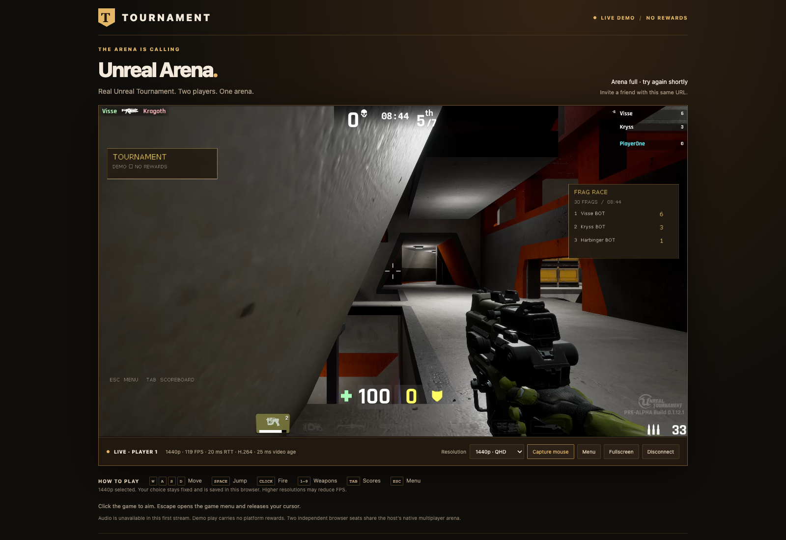

# Browser stream performance — September 21, 2026

## Direct GPU encoding: 1080p and 1440p at approximately 120 FPS

The live host now pairs native `-GpuVideo` with `NATIVE_GPU_VIDEO=1`. The old path read the whole GPU backbuffer into CPU memory, converted this build's 10-bit RGB image to 8-bit pixels, sent raw frames to Node/FFmpeg, then converted/uploaded them for NVENC. Increasing resolution amplified that work. A baseline immediately before this change measured 49.2 FPS at 1080p and 28.7 FPS at 1440p; the older resolution-selection measurements below show the same limitation.

The new original integration registers a private D3D11 GPU texture with NVENC, copies the game backbuffer GPU-to-GPU, and returns only compressed H.264 access units to the gateway. RGB10A2 conversion stays on the GPU. FFmpeg and full raw image transfers are removed from the live path. Rendering, textures, movement, H.264 High/P3 quality, bitrate targets and selected native resolution remain unchanged. Capture is bounded to one in-flight job; packets, network credit and browser decoder queues remain bounded. Errors produce native diagnostics and reconnect attempts, not an automatic resolution downgrade. An opt-in `-TournamentStreamStats` command-line flag reports capture/encode timings without production log flushing every five seconds.

Windows host: RTX 5090, driver 616.56, recovered UE4.15 D3D11 offscreen clients and one authoritative deathmatch server. Two isolated Chrome 153 contexts on the M4 Pro Mac received the public HTTPS stream simultaneously. Each profile was sampled for approximately 32 seconds, with alternating player movement/fire and menu/capture checks; both seats used the listed resolution.

| Native size (both seats) | Seat 1 draw FPS | Seat 2 draw FPS | Seat 1 / 2 p95 gap | Seat 1 / 2 p99 gap |
| --- | ---: | ---: | --- | --- |
| 1920×1080 | 119.9 | 119.0 | 16.7 / 16.1 ms | 94.0 / 94.9 ms |
| 2560×1440 | 119.0 | 119.3 | 15.4 / 16.2 ms | 94.5 / 94.1 ms |

Both 1440p native feeds reported approximately 120 FPS. The initial single-1440p capture/encode sample averaged 3.7–4.9 ms on the render thread. Full decoded dimensions were asserted, and screenshots showed uncropped views with distinct PlayerOne/PlayerTwo standings. Saved 1440p survived disconnect/reload/rejoin; changing the other seat to 1080p did not alter it. No page errors occurred. Test seats were released.

The Mac route still had 9–16 gaps above 100 ms per sample and maximum gaps of 108–199 ms. The average FPS improvement does **not** remove those network pauses or demonstrate physical panel scanout at 120 Hz. Video age now starts at compressed receipt after native encoding, so it excludes more upstream work than the previous raw-receipt measurement. It is not input-to-photon latency. A second run on the final build kept both menus closed, with one player moving, jumping and firing for 30 seconds while both high-resolution streams continued. At 1080p the seats measured **118.1 / 119.7 FPS** (p95 17.7 / 16.9 ms); at 1440p **117.8 / 119.1 FPS** (p95 17.0 / 18.4 ms). Native ingress stayed about 120 FPS. This run had 13–20 gaps above 100 ms per seat/profile, with maximum gaps of 109–177 ms. Screenshots show the full first-person HUD, visible bot characters and the independent player's death/respawn screen. Rejoin, saved resolution and independent resizing passed again with zero page errors.

A separate Windows Edge headless run on the wired game host tested 720p → 1080p → 1440p while the other browser remained at 720p. It measured 120.0 / 119.7 / 59.4 FPS respectively, with maximum gaps 27.3 / 25.2 / 100.7 ms. The 1080p wired sample had no gap above 100 ms. This hosting-session browser uses software decoding; at 1440p its displayed frames lagged the native source, and the final mixed 1440p/1080p health sample also showed host-source rates falling to 106.8/111.1 FPS under the extra local browser load. Thus the Mac result is **not** a promise of 120 FPS on every decoder/device. After the test browsers closed, both native feeds returned to approximately 120 FPS. Settings/arrow navigation, rapid Escape/recapture, independent dimensions, reload persistence, disconnect/rejoin and zero page errors passed on Edge too.

Native compilation completed with MSVC v140, with no encoder header macro warnings. All 63 browser/transport tests, eight event-contract tests, and Windows launcher syntax/INI/consent checks passed. New tests cover native compressed framing, malformed envelope/profile rejection, fragmentation, two-seat isolation, resolution reconfiguration, and bypassing FFmpeg. The permissively licensed NVIDIA API 13.0 header is pinned; no driver or game binaries are redistributed.

The sections below preserve prior measurements for comparison; their old CPU-readback limits no longer describe the live GPU path.

## Per-player resolution selection (2026-09-21)

The live page now offers 720p, 1080p and 1440p. The chosen resolution persists in browser local storage, is reapplied after reconnect/reload, and is never automatically lowered. Native rendering remains at 100% scale. Each browser changes only its leased native client's viewport and encoder; the authoritative multiplayer server and other player's resolution remain unchanged. Health reports actual and requested resolution separately.

The resize path synchronizes Slate window geometry with the actual GPU backbuffer. The launcher reserves maximum 2560×1440 window bounds before selecting the startup size: without that reservation UE4's session-zero window limits clipped larger images into the old viewport. The native plugin drains its outstanding readback once on resize and starts a new bounded frame connection. Encoders are selected from exact raw frame lengths, and callbacks from superseded encoders cannot publish stale images. The browser recreates its decoder and canvas when dimensions change, even with the same codec string.

Further changes retain the native packet allocation across frames rather than freeing and reallocating several megabytes per picture, request a low-latency canvas where supported, and keep existing bounded capture/encode/network queues. These reduce avoidable overhead; they do not establish a higher FPS result. Escape now releases a newly acquired pointer lock even when its asynchronous change event has not arrived yet, fixing a reproduced rapid Resume → capture → Escape trap.

Native compilation, 60 browser/transport tests, eight event tests and Windows launcher checks passed. Tests include seat isolation, coalesced resize requests, invalid size/seat claims, stale encoder callbacks, native reconnect, saved preference, low-FPS preservation, and rapid mouse recapture. The actual Mac browser displayed full 2560×1440 video; screenshots confirmed the full image rather than a cropped old-size viewport.

Two independent Windows Edge contexts joined the same public arena. Each profile was sampled for approximately ten seconds with movement and firing, while the second seat continued receiving 720p pictures:

| Selected size | Measured FPS | p95 gap | p99 gap | Maximum gap |
| --- | ---: | ---: | ---: | ---: |
| 1280×720 | 96.1 | 20.1 ms | 28.1 ms | 41.4 ms |
| 1920×1080 | 47.2 | 36.2 ms | 44.1 ms | 49.1 ms |
| 2560×1440 | 29.5 | 48.9 ms | 61.5 ms | 65.2 ms |

No sample had a gap above 100 ms. These short wired-host samples are not a Wi-Fi or long-session guarantee. The second player's dimensions remained unchanged and frames continued throughout each switch. Settings navigation, sensitivity adjustment, Escape, firing after recapture, disconnect/rejoin, full-page reload with the saved 1440p preference, and simultaneous 1440p + 1080p seats passed with zero page errors. The two browser contexts ran on the host itself, adding work relative to the earlier Mac/Windows split test. Test seats were released afterward.

 Frame rate counts decoded canvas draws, not physical display refresh. Higher resolution remains limited by the native capture path; it is not a 120 FPS high-resolution result.

## Image clarity follow-up: HD with a measured speed tradeoff

The current host profile is **1280x720, target 120 FPS, 12 Mbit/s H.264 High / NVENC P3**. The old profile was 960x540, 6 Mbit/s Baseline / P1. The new canvas and decoder retain the actual negotiated resolution end to end. The toolbar displays `720p` so source resolution cannot be mistaken for screen size. The native launcher requests 100% render scale, no motion blur or depth of field, FXAA instead of temporal AA, and 16x anisotropic filtering. The render ceiling is 240 FPS to give capture headroom, not a claim that the stream reaches 240 FPS.

At the final settings, a 20-second Windows Edge gameplay run with the other browser seat connected measured **102.7 FPS**, p95 17.8 ms, p99 25.3 ms, maximum 42.5 ms, and no gaps above 50 ms. Menu, recapture, firing, movement and reconnect checks passed with no page errors. The Mac Chromium sample measured **108.8 FPS** across 3,259 draws in 30 seconds, approximately 10.88 Mbit/s, p95 18.3 ms, p99 97.6 ms and maximum 112.8 ms. The Mac still had 18 gaps above 100 ms. This is sharper than the previous profile but not a sustained 120 FPS result or a fix for the Mac network pauses.

We also tested 1920x1080 at 24 Mbit/s with two seats. It decoded at the full resolution and passed control/reconnect checks, but delivered only **50.2 FPS** with the 144 FPS native render ceiling. The native raw feed was similarly slow, locating the limit upstream of browser decode. It is supported as an optional host configuration, not the selected live profile. A subsequent 720p experiment with the 144 ceiling measured 102.0 FPS; raising the ceiling to 240 did not restore sustained 120 FPS in the final gameplay run.

The accepted raw sizes are exactly 960x540x4, 1280x720x4 or 1920x1080x4 BGRA, selected by trusted host configuration. One parser allocation and three encoder pictures bound memory; JPEG and encoded-packet size limits remain 4 MiB. Client metadata, native viewport, parser and encoder must use the same profile. All 53 browser tests, native build and Windows launcher checks passed. Existing account/reward and Epic licensing limitations remain unresolved.

The earlier measurements below used 540p unless otherwise stated.

## Gameplay and Mac refresh follow-up

Fixed an input scheduling defect that reproducibly sent only 99 mouse updates during 120 evenly spaced animation callbacks. The sender now preserves its deadline with a 0.5 ms tolerance and resets after idle time without catch-up bursts. Regression tests cover 120/119.88 Hz, alternating early/late callbacks, and 360/1000 Hz rate limits. Added the advertised arrow controls through the browser, gateway allowlist and native receiver; Up/Down navigate the menu and Left/Right adjust settings.

FPS is now normalized by actual elapsed time, including delayed timer callbacks. Hover the FPS metrics for measured browser animation cadence and the limits of the latency measurements. The actual Codex in-app browser on this M4 Pro Mac reported about 121 Hz animation cadence and 119 FPS video after reload. The headless test browsers reported 60 Hz animation cadence while decoding about 119 FPS. Neither measurement is physical panel scanout.

After deployment, a 30-second Mac Chromium sample counted 3,571 canvas draws at 119.0 FPS: p95 17.7 ms, p99 96.4 ms, max 113 ms, with 23 gaps above 100 ms. A separate 20-second Windows Edge gameplay sample counted 2,421 draws at 118.9 FPS: p95 16.7 ms, p99 24 ms, max 51.9 ms, with one gap above 50 ms. Both runs used the public URL, with two independent seats connected during verification. Network pauses on the Mac remain unresolved; these results do not establish zero-lag play.

Visible checks confirmed distinct PlayerOne/PlayerTwo views, active bots and native standings, firing, death and respawn back to 100 health, Settings reached with arrows/Enter, Escape/recapture, fullscreen and disconnect/rejoin. Edge reported no page errors and recovered pointer lock. The native server's logs before the update also recorded completed Deck → Outpost → Deck rotation. Browser tests: 49 passing; event-contract tests: eight passing. The native plugin rebuilt successfully with MSVC v140. The public URL is unchanged.

## 120 FPS follow-up

The public host now defaults to 120 FPS. With a Mac Chromium seat and Windows Edge 153 seat connected simultaneously, the final warmed tests measured:

| Browser | Sample | Canvas draw FPS | p50 gap | p95 gap | p99 gap | Maximum gap |
| --- | --- | ---: | ---: | ---: | ---: | ---: |
| Windows Edge, wired host, software decoder | 20 seconds / 2,391 frames | 119.6 | 7.9 ms | 16.4 ms | 20.9 ms | 35.8 ms |
| Mac Chromium, Wi-Fi | 30 seconds / 3,546 frames | 118.5 | 6.7 ms | 17.7 ms | 97.1 ms | 120.4 ms |

The wired run had zero gaps over 50 ms, no page errors, and passed movement/fire, menu and disconnect/rejoin checks. Mac binary video bandwidth was 5.93 Mbit/s; its toolbar read 120 FPS / 18 ms RTT at the end. The Mac still had 22 gaps over 100 ms in that sample, consistent with the network-path issue diagnosed below. These numbers measure actual canvas draws, not panel scanout; no zero-latency or stutter-free Wi-Fi claim is made.

The first 120 FPS attempt delivered only about 113 FPS. The final changes give capture scheduling headroom by rendering at a 144 FPS ceiling while limiting capture/encoding to 120, disable the old engine smooth-frame-rate cap, use single-threaded NV12 conversion, and stop treating Node's ordinary large-write backpressure signal as an automatic frame drop. The explicit three-picture encoder bound remains. Health now reports raw and encoded FPS separately; both native streams reached about 120 FPS.

120 FPS uses 8.33 ms decoder timestamps and a 6 Mbit/s encoder target. Network credit is 24 pictures at 120 FPS, preserving the same 200 ms time bound as 12 at 60 FPS. A short burst of predicted pictures may decode without repeatedly resetting the codec; the 120 FPS decoder is bounded to 12 queued decode requests before reset and 16 source timestamps. Mouse forwarding is capped at 120 Hz and the message budget allows receipts and input together. Neither the gateway nor the browser can award platform rewards.

All 45 browser/transport tests, eight event-contract tests, and Windows launcher checks pass. The native plugin was rebuilt with MSVC v140. Select both `STREAM_FPS=60` and native `-StreamFPS 60` to use the lower-bandwidth profile. The main live URL is unchanged.

The sections below preserve the earlier 60 FPS baseline measurements for comparison.

## Earlier 60 FPS changes deployed

- Select the RTX 5090 explicitly. The old UE4.15 adapter heuristic chose the AMD integrated GPU; NVIDIA utilization was effectively zero before the change. Both native client logs now identify the RTX adapter. With both streams running, the RTX showed roughly 12% GPU utilization and 1% encoder utilization.
- Render and capture at up to 60 Hz. Remove the per-frame game-thread render flush and CPU JPEG compression from the optimized path. Keep one capture in flight and send completed frames immediately.
- Encode game-only BGRA backbuffers with FFmpeg 9.0.2/NVENC, H.264 Baseline, approximately 4 Mbit/s per seat, no B-frames or lookahead. Decode with WebCodecs. Raw pixels remain on the Windows host.
- Bound raw, network and decoder queues. Acknowledgements cover the browser endpoint beyond the tunnel. Ten-frame keyframe spacing shortens recovery after prediction is lost. Reset blocked decoders and recycle stalled encoders.
- Detect actual decoder capability. Select software decoding when hardware is unavailable, discard obsolete decoder callbacks, and report unsupported decoding instead of leaving an endless blank resynchronization screen.
- Keep native multiplayer, independent seat controls, authoritative match standings and automatic map rotation. No changes to movement, weapons, collision or game textures.

## Measurements

Measured through the public HTTPS demo, with the same Windows game host. FPS is counted from actual canvas draws; frame gaps are intervals between draws, not monitor scanout. Bandwidth counts binary video payloads and excludes transport overhead. These are short diagnostic samples, not an uptime or cross-device guarantee.

| Sample | Draw FPS | Median gap | 95th-percentile gap | Maximum gap | Video bandwidth |
| --- | ---: | ---: | ---: | ---: | ---: |
| Before: JPEG, integrated GPU, Mac Chromium, ~15 seconds | 19.9 | 38.2 ms | 112.5 ms | 169.6 ms | 7.22 Mbit/s |
| H.264, two concurrent Mac Chromium seats, player 1, 30 seconds | 59.3 | 15.6 ms | 29.5 ms | 115.7 ms | 3.95 Mbit/s |
| H.264, two concurrent Mac Chromium seats, player 2, 30 seconds | 59.5 | 15.2 ms | 29.8 ms | 122.9 ms | 3.97 Mbit/s |
| Final build, Windows Edge 153 on wired host, with Mac player also connected, 20 seconds | 59.3 | 16.5 ms | 27.9 ms | 48.0 ms | — |

The Mac samples still contain intermittent ~100 ms network-delivery gaps. Separating raw-source timestamps from browser arrival/draw timestamps located these gaps after native capture. A 20-second simultaneous test found no native-source gap above 44 ms, while browser arrival gaps reached 120 ms. A direct LAN SSH forward to the same host also reproduced those pauses; testing HTTP/2 instead of QUIC did not remove them. The original public tunnel and URL were preserved.

On the wired Windows host, a separate **public-URL WebSocket transport probe** received 870 measured frames in an approximately 15-second run after discarding startup pictures: median gap 16.4 ms, p95 24.0 ms, p99 32.1 ms, maximum 36.3 ms, and **zero gaps above 50 ms**. A host-loopback probe also had no gaps above 50 ms. This isolates a problem specific to the Mac's network path; it does not prove a particular Wi-Fi driver or setting is the cause. The Windows transport probe is not a browser render benchmark. The subsequent Edge 153 browser test is listed separately above: it used the software-decoder fallback, rendered 1,186 frames, had p99 gaps of 32.6 ms and no gaps over 50 ms, and passed disconnect/rejoin without page errors. It ran headless on the host while the Mac controlled the other seat; this tests the public route but not a distant player location.

Toolbar RTT was commonly 17–30 ms. “Video age” estimates gateway raw receipt to browser draw using a clock offset derived from the best RTT. It excludes native capture, input processing and display scanout; do not present it as input-to-photon latency.

## Verification

- Windows Edge hardware decoding was unavailable under the hosting session. Capability detection selected software and restored actual gameplay; before this fix the page repeatedly attempted an unsupported hardware configuration.
- Native plugin compiled with the restored MSVC v140 toolchain; both rendered clients identify the RTX 5090.
- Two independent Chromium browser sessions joined simultaneously, displayed distinct views, captured the mouse, moved, fired, died and respawned. Both ran near 60 FPS while connected.
- Deck completed and rotated automatically to Outpost with the optimized native capture path. Both streams resumed on Outpost.
- Deliberately terminated both owned FFmpeg encoders. The gateway recycled them, both native feeds resumed, and both browsers retained their seats and returned to live video without restarting the game server.
- Reloaded the user’s Codex in-app browser and verified the actual live game canvas with H.264 and a toolbar reading around 60 FPS. This is a functional check, not a separate frame-pacing benchmark.
- Forty gateway/frontend/codec tests cover packet framing, independent seats, token/origin/input validation, missing pongs, menu state, disconnect/rejoin, encoder restart, stale acknowledgements, prediction loss, decoder resource cleanup, obsolete callbacks and unsupported hardware fallback. Eight authoritative-event tests and Windows launcher checks also pass.

## Reproduce and interpret

1. Start the paired native `-GpuVideo` and gateway `NATIVE_GPU_VIDEO=1` modes using [the hosting instructions](browser-hosting.md). Confirm the correct GPU in both native logs.
2. Warm both maps. Confirm both `/api/health` seats are fresh and report about 120 encoded FPS.
3. Join from two independent desktop browser profiles. Exercise aiming, movement, fire, respawn, Menu/Resume, Disconnect/Play Again and automatic map travel.
4. Measure canvas `drawImage` callbacks over a fixed interval after first-frame startup. Report average FPS plus p50/p95/p99/max gaps; average FPS alone hides bursts.
5. Compare binary packet arrival intervals against each packet's raw-receipt timestamp to separate native and delivery stalls. Check `encoderDropped`, `videoDropped` and `unacknowledgedFrames` in health. Drops during connection startup/keyframe synchronization are expected; increasing counts during steady play require investigation.
6. Repeat on the actual player's network. A fast desktop wired test does not establish smoothness on a different Wi-Fi connection.

This remains a two-seat native-game streaming demo with selectable resolution. It is not a downloadable browser/WASM engine. Audio, Tournament accounts, monetary rewards and private anti-cheat ingestion remain unavailable. Firefox and Safari gameplay/performance have not been verified. Reliable WebSocket transport can still pause under packet loss; moving to managed GPU hosting with a media transport such as WebRTC remains a future option if broader WAN testing requires it.
